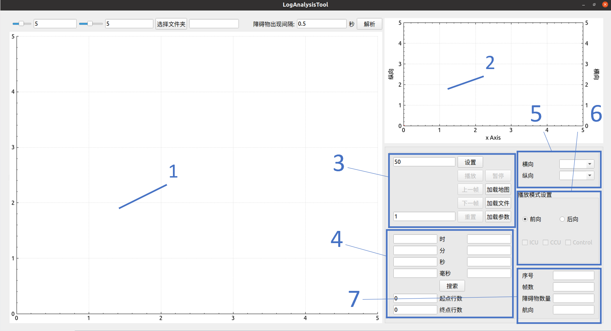

# 使用说明

本回放工具集成了预测和控制的csv文件的回放

## 界面介绍

​	如图所示

1. 预测日志的回放界面，主要显示地图、车体、障碍物信息
2. 控制日志的回放界面，横向数据的y对应右侧轴，下称横向y轴，纵向数据的y对应左侧轴，下称纵向y轴
3. 功能按钮，用于加载文件，设置播放间隔，重置等功能
4. 时间戳的显示
5. 控制数据的可选项，为下拉复选框
6. 播放模式的设置
7. 信息的输出

## 使用方法

### 预测使用

#### 使用步骤

1. 点击加载文件：选择文件名含有front_sense或result的csv文件
2. 点击加载文件：选择文件名含有F_1的地图文件，通常为任务文件内的地图文件 ==注意：只有加载了地图文件才会更新坐标系到具体位置==
3. 播放模式设置中勾选CCU
4. 点击播放，预测的界面将会逐帧播放信息

#### 功能介绍

1. 设置为0时0分0秒0毫秒后，点击搜索，点击播放，会跳转至有障碍物的数据

### 控制使用

#### 使用步骤

1. 点击加载文件：选择文件名含有CCU的csv文件
2. 播放模式设置中勾选Control
3. 点击播放
4. 通过界面介绍中的5的下拉复选框勾选相应数据，结果显示在控制界面中

#### 功能介绍

1. 点击控制界面中数据的曲线，可显示当前数据的名称

2. 分别点击x轴，纵向y轴，横向y轴可实现三个轴独立的平移缩放功能

3. 点击显示的数据曲线可实现对应的y轴的缩放和平移功能

4. 更改控制数据显示的范围：

   1. 点击暂停

   2. 修改起始行数、结束行数

   3. 点击播放

      ==注意：只有在点击暂停后才能够修改起始和结束行数==

### 预测和控制的数据匹配使用

 #### 使用步骤

1. 点击加载文件：选择要显示的预测和控制文件
2. 播放模式勾选ccu和control
3. 点击播放 ==注意，若匹配失败，则显示无法匹配，需要重新打开程序加载时间戳相对应的控制和预测日志==，预测和控制的数据分别显示在各自界面上并逐帧播放

#### 功能介绍

1. 界面介绍4中的时间会分别显示预测和控制的时间戳，若逐帧播放过程中出现不匹配的情况，可通过点击暂停，点击播放重新匹配
2. 控制数据的选择同控制使用中相同

### 逐帧播放中通用功能介绍

1. 设置播放间隔
   1. 点击暂停
   2. 修改设置前的播放间隔，单位为ms
   3. 点击设置
   4. 点击播放
2. 重置
   1. 点击暂停
   2. 修改重置前的帧数
   3. 点击重置
3. 搜索
   1. 点击暂停
   2. 修改界面介绍4中左侧的时间数据
   3. 点击搜索
   4. 点击播放